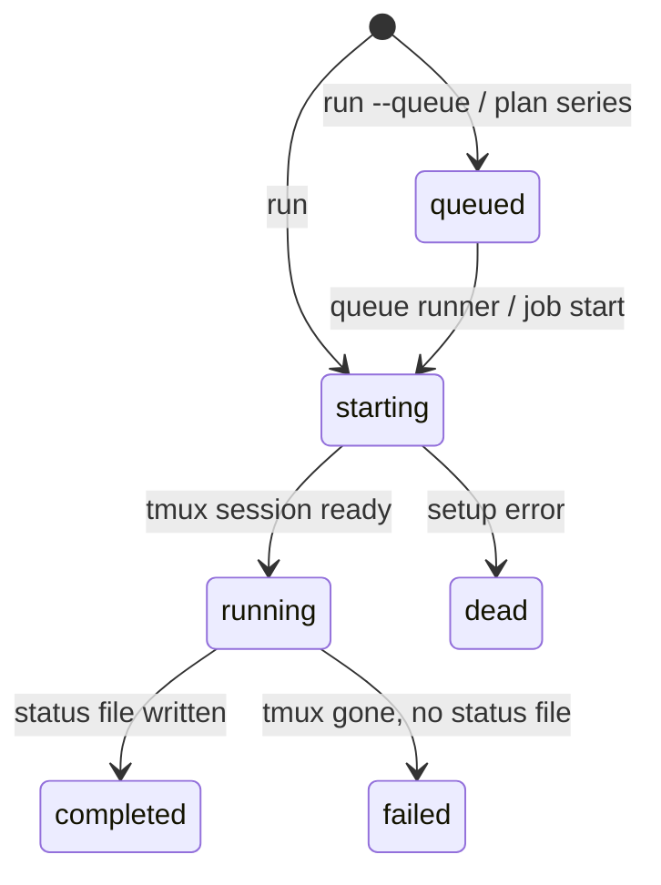
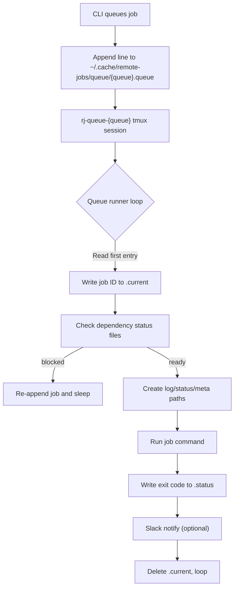

# Remote Jobs Architecture

This document describes the architecture and design of the Remote Jobs CLI tool.

## Overview

Remote Jobs is a CLI tool for managing persistent tmux sessions on remote hosts. It solves the problem of long-running jobs terminating when SSH connections drop due to network issues, laptop closure, or session timeouts.

```
┌─────────────────────────────────────────────────────────────────────┐
│                          Local Machine                               │
├─────────────────────────────────────────────────────────────────────┤
│  ┌──────────────┐    ┌──────────────┐    ┌──────────────────────┐  │
│  │   CLI (cmd)  │───▶│   Database   │    │   Config (YAML)      │  │
│  │              │    │   (SQLite)   │    │                      │  │
│  └──────┬───────┘    └──────────────┘    └──────────────────────┘  │
│         │                                                           │
│         │ SSH                                                       │
│         ▼                                                           │
├─────────────────────────────────────────────────────────────────────┤
│                         Remote Host(s)                               │
├─────────────────────────────────────────────────────────────────────┤
│  ┌──────────────┐    ┌──────────────┐    ┌──────────────────────┐  │
│  │    tmux      │───▶│   Job Logs   │    │   Slack Notify       │  │
│  │   Session    │    │   (.log)     │    │   (on completion)    │  │
│  └──────────────┘    └──────────────┘    └──────────────────────┘  │
└─────────────────────────────────────────────────────────────────────┘
```

### Facades vs Core

User-facing layers (CLI + TUI) now call into a shared core service that owns
validation, database mutations, and reconciliation with remote hosts. This
guarantees that every operation—whether triggered by a key binding or a Cobra
command—runs through the same code path. The facades handle only input parsing,
presentation, and read-heavy listing queries. The core service records intent,
kicks off sync, and returns structured results. See `docs/facade-core.md` for
details on the responsibilities split.

## Job States

Every job lives in the local SQLite database and transitions through a finite
set of states. The CLI records each transition so commands such as `status`,
`list`, and `sync` can reason about progress even when the host is offline.

| State       | Description                                                                 |
|-------------|-----------------------------------------------------------------------------|
| `starting`  | Job entry created; CLI is preparing the tmux session and remote files.      |
| `running`   | tmux session launched successfully and the wrapper script is executing.     |
| `completed` | Job wrote an exit code to the `.status` file (success or failure recorded). |
| `dead`      | Job failed to start (setup error before tmux/session execution).            |
| `failed`    | Job terminated unexpectedly after starting (no status file found).          |
| `killed`    | Job was terminated in response to an explicit user action.                  |
| `canceled`  | Queued job was explicitly removed before it started.                        |
| `queued`    | Job was added to a remote queue file and awaits the queue runner.           |
| `pending`   | Local intent recorded (kill/start/change) awaiting reconciliation.          |



## Directory Structure

```
remote-jobs/
├── main.go                 # Entry point
├── cmd/                    # CLI commands (Cobra)
│   ├── root.go            # Root command, default command handling
│   ├── job.go             # Job subcommand (groups job operations)
│   ├── run.go             # Start jobs (supports --from, --timeout, --queue)
│   ├── log.go             # View job logs
│   ├── kill.go            # Kill running jobs
│   ├── status.go          # Check job status (via job subcommand)
│   ├── list.go            # Query job history (via job subcommand)
│   ├── restart.go         # Restart jobs (via job subcommand)
│   ├── describe.go        # Set job description (via job subcommand)
│   ├── sync.go            # Sync job statuses
│   ├── cleanup.go         # Clean up finished sessions
│   ├── prune.go           # Remove old jobs
│   ├── queue.go           # Queue commands (add, start, stop, list)
│   ├── tui.go             # Launch interactive TUI
│   ├── embed.go           # Embedded files (notify script)
│   └── notify-slack.sh    # Slack notification script (embedded)
├── internal/
│   ├── config/            # Configuration management
│   │   └── config.go      # YAML config loading
│   ├── db/                # Database operations
│   │   ├── db.go          # Job CRUD, queries, migrations
│   │   └── db_test.go     # Database tests
│   ├── ops/               # Unified job operations (CLI + TUI)
│   │   ├── ops.go         # Queue-and-execute pattern, deferred ops
│   │   ├── kill.go        # Kill job operations
│   │   ├── run.go         # Run/restart job operations
│   │   └── ops_test.go    # Operation tests
│   ├── session/           # Session/file path management
│   │   ├── session.go     # Tmux naming, file paths, metadata
│   │   └── session_test.go
│   ├── ssh/               # SSH operations
│   │   ├── ssh.go         # SSH commands, retry logic, process stats
│   │   └── command_test.go
│   ├── logcache/          # Offline cache for finished job logs
│   ├── progress/          # Progress parsing + incremental log tracking
│   ├── llm/               # Background AI description generator
│   ├── queuejob/          # Helpers for starting/moving queued jobs
│   ├── plan/              # Plan parser, DAG builder, executor
│   └── tui/               # Terminal UI
│       ├── model.go       # Bubble Tea model, update loop, views
│       ├── host.go        # Host info parsing
│       └── styles.go      # Lipgloss styling
└── docs/
    └── architecture.md    # This document
```

## Core Components

### 1. CLI Layer (`cmd/`)

Built with [Cobra](https://github.com/spf13/cobra), the CLI provides subcommands for all operations.

**Command Flow:**

```
remote-jobs run [--from ID] [--timeout DURATION] [--queue] <host> <command>
    │
    ├── 0. (If --from) Copy settings from existing job (can override)
    ├── 1. Create job record in SQLite (status: "starting" or "queued")
    ├── 2. Generate unique tmux session name (rj-{job_id})
    ├── 3. Create log directory on remote (~/.cache/remote-jobs/logs/)
    ├── 4. Save metadata file on remote
    ├── 5. Build wrapper command (cd, logging, exit code, timeout monitor)
    ├── 6. SSH: tmux new-session -d -s 'rj-N' bash -c '...'
    ├── 7. Update job status to "running"
    └── 8. Print monitoring instructions
```

**Key Flags:**
- `--from <id>`: Copy settings from existing job (command, directory, description)
- `--timeout <duration>`: Automatically kill job after duration (e.g., "2h", "30m")
- `--queue`: Add to job queue instead of running immediately

**Key Design Decisions:**
- Job ID is allocated BEFORE starting the tmux session, ensuring the database always knows about the job
- If SSH fails during setup, the job is marked as "dead" with the error message
- Connection failures automatically record the job locally and defer the queue
  append so it starts once the host is back online—no special retry flag needed.
- `remote-jobs run --from <id>` lets you copy settings into a brand-new job when
  you want to make edits before re-running.

### 2. Operations Layer (`internal/ops/`)

Provides unified job operations used by both CLI and TUI. All operations follow the same queue-and-execute pattern for network resilience.

**Pattern:**
1. Update the local database to reflect the intended state (e.g., `pending_status` = "killed").
2. Attempt to drain the queue for that host
3. If host unreachable, operation stays queued for next sync
4. If host reachable, execute and remove from queue

**Key Functions:**

| Function | Purpose |
|----------|---------|
| `KillJob` | Kill a running job's tmux session |
| `RunJob` | Start a new job on a host |
| `RestartJob` | Kill existing job and start a new one with same command |
| `QueueAndExecute` | Core pattern: queue operation, then drain |
| `SyncAndReconcile`           | Probe remote, then reconcile local and remote states  |

**Conflict Resolution:**

When operations conflict, later operations cancel earlier incompatible ones:
- Killing a job removes any pending run/restart operations for that job
- This prevents "zombie" operations from executing after a job is killed

**Benefits:**
- Consistent behavior between CLI and TUI
- Network-resilient: operations survive disconnections
- Idempotent: duplicate operations are detected and skipped

### 3. Database Layer (`internal/db/`)

Uses [modernc.org/sqlite](https://gitlab.com/cznic/sqlite) (pure Go SQLite) for zero CGO dependencies.

**Schema:**

```sql
CREATE TABLE jobs (
    id INTEGER PRIMARY KEY AUTOINCREMENT,
    host TEXT NOT NULL,
    session_name TEXT,           -- Deprecated: legacy compatibility
    working_dir TEXT NOT NULL,
    command TEXT NOT NULL,
    description TEXT,
    tags TEXT,                  -- JSON-encoded tag list
    error_message TEXT,          -- For failed jobs
    start_time INTEGER,          -- NULL for queued jobs that haven't started
    end_time INTEGER,
    exit_code INTEGER,
    status TEXT NOT NULL DEFAULT 'running',
    queue_name TEXT              -- Name of queue for queued jobs
);

-- Indexes for common queries
CREATE INDEX idx_jobs_host ON jobs(host);
CREATE INDEX idx_jobs_session ON jobs(session_name);
CREATE INDEX idx_jobs_status ON jobs(status);
CREATE INDEX idx_jobs_start ON jobs(start_time DESC);
```

### 4. SSH Layer (`internal/ssh/`)

Wraps SSH/SCP commands with error handling and retry logic.

**Key Functions:**

| Function | Purpose |
|----------|---------|
| `Run` | Execute SSH command, capture stdout/stderr |
| `RunWithTimeout` | SSH with configurable timeout (for TUI responsiveness) |
| `RunWithRetry` | Retry on connection errors (5 attempts, 30s delay) |
| `TmuxSessionExists` | Check if tmux session is running |
| `TmuxKillSession` | Kill a tmux session |
| `ReadRemoteFile` | Read file contents (for status/log files) |
| `GetProcessStats` | Fetch CPU, memory, GPU stats from /proc |

**Connection Error Detection:**

```go
var connectionErrorPattern = regexp.MustCompile(
    `(?i)(connection timed out|operation timed out|no route to host|...)`
)
```

The SSH layer distinguishes connection errors (which may be transient) from command errors (which indicate real failures).

### 5. Session Management (`internal/session/`)

Manages tmux session naming and remote file paths.

**Naming Conventions:**

| Item | Pattern | Example |
|------|---------|---------|
| Tmux session | `rj-{job_id}` | `rj-42` |
| Log file | `~/.cache/remote-jobs/logs/{job_id}-{timestamp}.log` | `42-20251213-143025.log` |
| Status file | `.../{job_id}-{timestamp}.status` | Contains exit code |
| Metadata file | `.../{job_id}-{timestamp}.meta` | Key=value pairs |
| PID file | `.../{job_id}-{timestamp}.pid` | Process ID |

**Wrapper Command:**

Jobs run inside a wrapper that:
1. Logs start timestamp and metadata (including timeout if specified)
2. Changes to working directory (with tilde expansion)
3. Starts timeout monitor in background (if --timeout specified)
4. Runs the actual command, capturing PID for timeout monitoring
5. Captures exit code when job completes
6. Writes exit code to status file
7. Optionally triggers Slack notification

**Timeout Monitor** (optional, if `--timeout` specified):
- Runs in background, monitors elapsed time
- Uses `bc` to parse duration strings (e.g., "2h", "30m", "1h30m")
- Checks every 10 seconds if timeout exceeded
- Kills job if timeout reached, logs timeout message

```bash
echo "=== START $(date) ===" > $LOG_FILE;
# (if timeout) Start background timeout monitor
cd $WORKING_DIR && { ($COMMAND) & CMD_PID=$!; echo $CMD_PID > $PID_FILE; wait $CMD_PID; } 2>&1 | tee -a $LOG_FILE;
EXIT_CODE=${PIPESTATUS[0]};
echo "=== END exit=$EXIT_CODE $(date) ===" >> $LOG_FILE;
echo $EXIT_CODE > $STATUS_FILE $NOTIFY_CMD
```

### 6. TUI (`internal/tui/`)

Built with [Bubble Tea](https://github.com/charmbracelet/bubbletea) (Elm architecture) and [Lipgloss](https://github.com/charmbracelet/lipgloss) (styling).

**Architecture:**

```
┌─────────────────────────────────────────────────────────┐
│                      Model                               │
├─────────────────────────────────────────────────────────┤
│  Jobs View:                    Hosts View:               │
│  - jobs []*db.Job              - hosts []*Host           │
│  - selectedIndex               - selectedHostIdx         │
│  - selectedJob (for logs)      - host info cache         │
│  - processStats                                          │
│  - logContent                                            │
├─────────────────────────────────────────────────────────┤
│  Background Operations:                                  │
│  - syncInterval (15s)          - Sync job statuses       │
│  - logRefreshInterval (3s)     - Refresh logs/stats      │
│  - hostRefreshInterval (30s)   - Refresh host info       │
└─────────────────────────────────────────────────────────┘
           │
           │ Update(msg)
           ▼
┌─────────────────────────────────────────────────────────┐
│  Message Types:                                          │
│  - tea.KeyMsg              - Keyboard input              │
│  - jobsRefreshedMsg        - DB query result             │
│  - syncCompletedMsg        - Background sync done        │
│  - logFetchedMsg           - SSH log fetch result        │
│  - processStatsMsg         - CPU/GPU stats               │
│  - hostInfoMsg             - Host system info            │
│  - tickMsg                 - Timer for background ops    │
└─────────────────────────────────────────────────────────┘
           │
           │ View()
           ▼
┌─────────────────────────────────────────────────────────┐
│  ╭─────────────────────────────────────────────────────╮│
│  │ ID   HOST         STATUS    STARTED   COMMAND      ││
│  │ 52   deepthought  ● running 2h ago    python ...   ││
│  │ 51   deepthought  ✗ exit 1  3h ago    python ...   ││
│  ╰─────────────────────────────────────────────────────╯│
│  ╭─────────────────────────────────────────────────────╮│
│  │ Details / Logs                                      ││
│  │ Job 52 on deepthought                               ││
│  │ Cmd: python train.py                                ││
│  │ CPU: 45% (1h23m user, 5m sys)                       ││
│  │ GPU 0: 85% util, 12.5GiB                            ││
│  ╰─────────────────────────────────────────────────────╯│
│  ↑/↓:nav l:logs s:sync n:new r:restart k:kill q:quit   │
└─────────────────────────────────────────────────────────┘
```

**Key TUI Features:**
- Two views: Jobs (default) and Hosts
- Split-screen: list at top, details/logs at bottom
- Background polling for status updates
- Real-time CPU/GPU stats for running jobs
- Modal overlays for job creation and long operations

### 7. Configuration (`internal/config/`)

YAML configuration at `~/.config/remote-jobs/config.yaml`:

```yaml
default_command: tui    # "help", "list", "tui", or "web"
sync_interval: 15       # Seconds between status syncs
log_refresh_interval: 3 # Seconds between log refreshes
host_refresh_interval: 30
web_enabled: true
web_port: 8127
```

### 8. Log Cache (`internal/logcache/`)

Remote log files are mirrored into `~/.cache/remote-jobs/logs/` whenever a job
finishes (or the queue runner writes a status file) so that `remote-jobs log`
and the TUI can fall back to an offline copy. The cache honors the configurable
age/size caps, prunes stale entries during `remote-jobs sync`, and quietly skips
files that are too large. When you run `remote-jobs log JOB_ID`, the CLI serves
cached bytes immediately and only re-fetches from SSH if the cache misses or
the job is still running.

### 9. Progress Tracking (`internal/progress/`)

The progress subsystem tracks how much of each log has already been tailed and
parses the newest `Progress:` line to present inline percentages. Supported
formats include `Progress: 75%`, `Progress: 9/14`, and `Progress: 9 of 14`. The
tracker feeds both the job list (status column shows `● 42%`) and the detail
pane (progress bar plus `step/total`) without constantly re-downloading entire
logs from the host.

### 10. AI Descriptions (`internal/llm/`)

If AI is enabled in config, a background generator polls the database for jobs
missing descriptions and asks an [ollama](https://ollama.com/) model to produce
one. Each description stores a hash of the model/prompt/settings combination so
future runs can skip already processed commands. The TUI registers a callback
so rows update live the moment an AI description is written, and any manual
`remote-jobs describe` edits override the generated text permanently.

### 11. Queue Helpers (`internal/queuejob/`, `internal/plan/`)

Queue-heavy workflows use dedicated helpers. `internal/queuejob` knows how to
remove entries from `~/.cache/remote-jobs/queue/*.queue`, rehydrate metadata,
and start a job immediately even if it never reached the remote queue (pending
deferred op). `internal/plan` parses YAML plans, expands IDs/aliases, validates
per-host dependency DAGs, and emits queue operations that match the semantics
documented in [docs/job-plans.md](job-plans.md). Together they let both humans
and agents orchestrate large job graphs while keeping local/remote state
consistent even when connections flap.

## Data Flow

### Starting a Job

```
User: remote-jobs run cool30 'python train.py'
                    │
                    ▼
┌───────────────────────────────────────────────────────────────┐
│ cmd/run.go                                                     │
│ 1. Parse args: host="cool30", command="python train.py"        │
│ 2. Get working dir (current dir with ~ substitution)          │
└───────────────────────────────────────────────────────────────┘
                    │
                    ▼
┌───────────────────────────────────────────────────────────────┐
│ internal/db/db.go                                              │
│ 3. INSERT INTO jobs ... RETURNING id                          │
│    status = "starting"                                         │
│    Returns job_id = 42                                         │
└───────────────────────────────────────────────────────────────┘
                    │
                    ▼
┌───────────────────────────────────────────────────────────────┐
│ internal/session/session.go                                    │
│ 4. Generate paths:                                             │
│    - tmuxSession = "rj-42"                                     │
│    - logFile = "~/.cache/remote-jobs/logs/42-20251213-...log" │
│    - statusFile, metadataFile, pidFile                         │
└───────────────────────────────────────────────────────────────┘
                    │
                    ▼
┌───────────────────────────────────────────────────────────────┐
│ internal/ssh/ssh.go                                            │
│ 5. ssh cool30 "tmux has-session -t 'rj-42' ..."               │
│    (check session doesn't exist)                               │
│ 6. ssh cool30 "mkdir -p ~/.cache/remote-jobs/logs"            │
│ 7. ssh cool30 "cat > ...meta << 'EOF'\n...\nEOF"              │
│ 8. ssh cool30 "tmux new-session -d -s 'rj-42' bash -c '...'"  │
└───────────────────────────────────────────────────────────────┘
                    │
                    ▼
┌───────────────────────────────────────────────────────────────┐
│ internal/db/db.go                                              │
│ 9. UPDATE jobs SET status = "running" WHERE id = 42           │
└───────────────────────────────────────────────────────────────┘
```

### Checking Job Status

```
User: remote-jobs sync
            │
            ▼
┌────────────────────────────────────────────────────────┐
│ cmd/sync.go                                             │
│ 1. SELECT DISTINCT host FROM jobs WHERE status='running'│
└────────────────────────────────────────────────────────┘
            │
            ▼
    For each host:
            │
            ▼
┌────────────────────────────────────────────────────────┐
│ For each running job on host:                           │
│ 2. ssh host "tmux has-session -t 'rj-42' && echo YES"  │
│                                                         │
│    If session exists:                                   │
│      -> Job still running (no DB update)                │
│                                                         │
│    If session doesn't exist:                            │
│ 3. ssh host "cat ~/.../42-...status"                   │
│                                                         │
│    If status file exists:                               │
│      -> Job completed, UPDATE with exit code            │
│                                                         │
│    If no status file:                                   │
│      -> Job died unexpectedly, mark as "failed"        │
└────────────────────────────────────────────────────────┘
```

## External Dependencies

| Package | Purpose |
|---------|---------|
| `github.com/spf13/cobra` | CLI framework |
| `github.com/charmbracelet/bubbletea` | TUI framework (Elm architecture) |
| `github.com/charmbracelet/bubbles` | TUI components (text input) |
| `github.com/charmbracelet/lipgloss` | TUI styling |
| `modernc.org/sqlite` | Pure Go SQLite (no CGO) |
| `gopkg.in/yaml.v3` | YAML config parsing |

## Remote Host Requirements

- **tmux**: Creates persistent sessions
- **bash**: Shell for wrapper commands
- **curl**: Slack notifications (optional)
- **nvidia-smi**: GPU stats (optional)

## File Locations

### Local (Client Machine)

| Path | Purpose |
|------|---------|
| `~/.config/remote-jobs/jobs.db` | SQLite database |
| `~/.config/remote-jobs/config.yaml` | Configuration |
| `~/.config/remote-jobs/config` | Legacy config (Slack webhook) |

### Remote (Server)

| Path | Purpose |
|------|---------|
| `~/.cache/remote-jobs/logs/{id}-{ts}.log` | Job output |
| `~/.cache/remote-jobs/logs/{id}-{ts}.status` | Exit code |
| `~/.cache/remote-jobs/logs/{id}-{ts}.meta` | Metadata |
| `~/.cache/remote-jobs/logs/{id}-{ts}.pid` | Process ID |
| `/tmp/remote-jobs-notify-slack.sh` | Notification script (deployed at runtime) |

## Design Decisions

### Why tmux instead of nohup/screen?

- **Session naming**: tmux allows named sessions that can be queried
- **Session persistence**: Sessions survive SSH disconnects
- **Widely available**: Pre-installed on most Linux servers
- **Status checking**: Can detect if session is still running

### Why SQLite?

- **Zero setup**: No server process needed
- **Single file**: Easy backup, portability
- **modernc.org/sqlite**: Pure Go, no CGO required
- **Local queries**: Fast filtering, searching, cleanup

### Why Bubble Tea for TUI?

- **Elm architecture**: Clean separation of state, updates, and views
- **Async-friendly**: Natural handling of SSH operations
- **Good ecosystem**: lipgloss for styling, bubbles for components

### Why embed the notify script?

- **Zero remote setup**: Script deployed with each job
- **Version consistency**: Script matches client version
- **Simpler workflow**: No separate installation step

### Agents as first-class users

- **Suggested next commands**: CLI responses include ready-to-run follow-ups so
  autonomous agents keep context without bespoke skills files.
- **TUI monitoring**: Humans can supervise and adjust queues while agents focus
  on issuing CLI operations.
- **Plan syntax**: YAML plans were intentionally shaped so agents can emit them
  directly from prompts, harnessing the same dependency/queue logic as humans.

### Occasionally connected hosts

- **Local-first state**: Jobs and queue operations persist in SQLite before any
  SSH call, guaranteeing intent is saved even if the network drops.
- **Deferred operations**: Everything that touches a host (start, kill, move,
  queue edits) is recorded and replayed when the host comes back.
- **Most-recent view**: The CLI/TUI always show the latest known state and make
  it obvious which operations are pending for the next successful sync.

## Error Handling

### Connection Errors

- Detected via regex pattern matching on SSH output
- Retry logic with configurable attempts and delays
- Failed operations are recorded locally and replayed once the host reconnects

### Job Failures

- Exit code captured in status file
- Jobs without status files marked as "failed"
- Error messages stored in database for debugging

### TUI Resilience

- SSH operations use timeouts to prevent UI blocking
- Failed fetches preserve previous data
- Background operations continue even if some hosts unreachable

## Queue System

The queue system allows jobs to run sequentially on a remote host without requiring the local machine to stay connected.

### Queue Architecture

```
┌─────────────────────────────────────────────────────────────────────┐
│                          Local Machine                               │
├─────────────────────────────────────────────────────────────────────┤
│  ┌──────────────┐    ┌──────────────┐                               │
│  │  queue add   │───▶│   Database   │  Records job with             │
│  │              │    │   (SQLite)   │  status="queued"              │
│  └──────┬───────┘    └──────────────┘                               │
│         │                                                           │
│         │ SSH: Append to queue file                                 │
│         ▼                                                           │
├─────────────────────────────────────────────────────────────────────┤
│                         Remote Host                                  │
├─────────────────────────────────────────────────────────────────────┤
│  ┌──────────────┐    ┌──────────────┐    ┌──────────────────────┐  │
│  │ Queue Runner │◀───│  Queue File  │    │   Job Logs           │  │
│  │ (tmux)       │    │  (.queue)    │    │   (.log, .status)    │  │
│  └──────┬───────┘    └──────────────┘    └──────────────────────┘  │
│         │                                                           │
│         │ For each job: run, capture output, notify                 │
│         ▼                                                           │
│  ┌──────────────┐                                                   │
│  │ Slack Notify │                                                   │
│  │ (on complete)│                                                   │
│  └──────────────┘                                                   │
└─────────────────────────────────────────────────────────────────────┘
```

### Remote Queue Runner

Jobs enqueued via `remote-jobs queue add`, `remote-jobs run --queue`, or plan
`series` blocks are executed by a small bash daemon that lives on each host.

- The script is embedded in the binary (`internal/scripts/queue-runner.sh`) and
  deployed on demand to `~/.cache/remote-jobs/scripts/queue-runner.sh`.
- A tmux session named `rj-queue-{queue}` runs the script so it keeps running
  even when you disconnect.
- Queue data is purely file-based to avoid keeping a network service running:
  - `~/.cache/remote-jobs/queue/{queue}.queue`: FIFO list of jobs (tab-separated).
  - `~/.cache/remote-jobs/queue/{queue}.current`: ID of the job currently
    executing (used by `status`/`sync` to detect runner progress).
  - `~/.cache/remote-jobs/queue/{queue}.runner.pid`: PID of the runner itself.
  - `~/.cache/remote-jobs/queue/{queue}.stop`: Presence signals the runner to
    exit after the current job.
- Each queue entry includes base64 encoded environment variables and dependency
  metadata so the runner knows whether it should wait for other jobs’ status
  files before starting.
- Queue entry columns (tab-separated): `job_id`, `working_dir`, `command`,
  `description`, `env_vars_b64`, `dependencies`.



**Activity Notes**

- Dependencies: The runner inspects `~/.cache/remote-jobs/logs/{dep}-*.status`
  files. If they are missing it re-queues the job at the end. If a dependency
  failed and the spec required success, the job is marked skipped by writing a
  log/status pair.
- Environment: The queue entry contains base64 encoded `VAR=value` lines. The
  runner decodes and exports them before launching the command.
- Metadata: A `.meta` file is written before execution so later `sync` calls can
  recover `start_time`, display-friendly command, queue name, etc.
- Queue persistence: Because the queue file is just a text file, jobs survive
  remote reboots. Re-starting the runner tmux session picks up where it left
  off.

The combination of queue files plus the runner loop means no long-lived process
is required on the local machine once the job is queued—the remote host and its
tmux sessions orchestrate everything.

## Shell Escaping and Quoting

Data passes through multiple shell contexts between the Go CLI and remote job
execution. This is a frequent source of bugs and requires careful attention.

### Data Flow Through Shell Contexts

1. **Go CLI** → builds SSH command string
2. **Local shell** → interprets SSH command
3. **SSH transport** → passes to remote shell
4. **Remote shell** → executes command or writes to queue file
5. **Queue runner (bash)** → reads queue file, parses fields, executes job

### Current Escaping Strategy

The queue file uses a tab-separated format with escape sequences:

```
JOB_ID<tab>WORKING_DIR<tab>COMMAND<tab>DESCRIPTION<tab>ENV_B64<tab>DEPS
```

Special characters in COMMAND and DESCRIPTION are escaped by `escapeForQueueFile()`:
- `\` → `\\` (backslash doubled)
- Actual newlines → `\n` (escaped)
- Actual tabs → `\t` (escaped)

The entire line is then base64-encoded for safe transport through SSH.

On the remote side, `queue-runner.sh`:
1. Decodes base64 to get the queue line
2. **Parses tab-separated fields FIRST** (critical: before escape conversion)
3. Converts escape sequences in command/description fields via `printf '%b'`
4. Executes the command

### Known Bug Pattern

A common bug pattern occurs when escape sequence conversion happens **before**
field parsing. For example, if `printf '%b'` is applied to the entire line
before awk splits by tabs, embedded `\n` sequences become real newlines and
break the field parsing.

**Symptoms**: Job ID gets polluted with command fragments, file paths contain
newlines, runner crashes immediately after logging `job.start`.

### Architectural Alternatives

The current text-based format is simple but fragile. Potential alternatives:

1. **Per-field base64**: Encode each field separately. Most robust but harder
   to inspect queue files manually.

2. **JSON format**: Well-defined escaping rules, standard tooling (jq). More
   complex bash parsing but eliminates custom escaping logic.

3. **Length-prefixed binary**: Unambiguous parsing, no escaping needed. Not
   human-readable.

4. **Structured file per job**: One JSON/YAML file per queued job in a
   directory. Eliminates multi-field parsing entirely but adds filesystem
   overhead.

The current approach is retained for debuggability (queue files are
human-readable text) but requires careful testing of escaping round-trips.

### Testing Escaping

`TestQueueEntryShellParsing` in `internal/ops/queue_test.go` verifies that
queue entries with multi-line commands survive the full escaping round-trip
by actually running bash to parse them the same way `queue-runner.sh` does.
