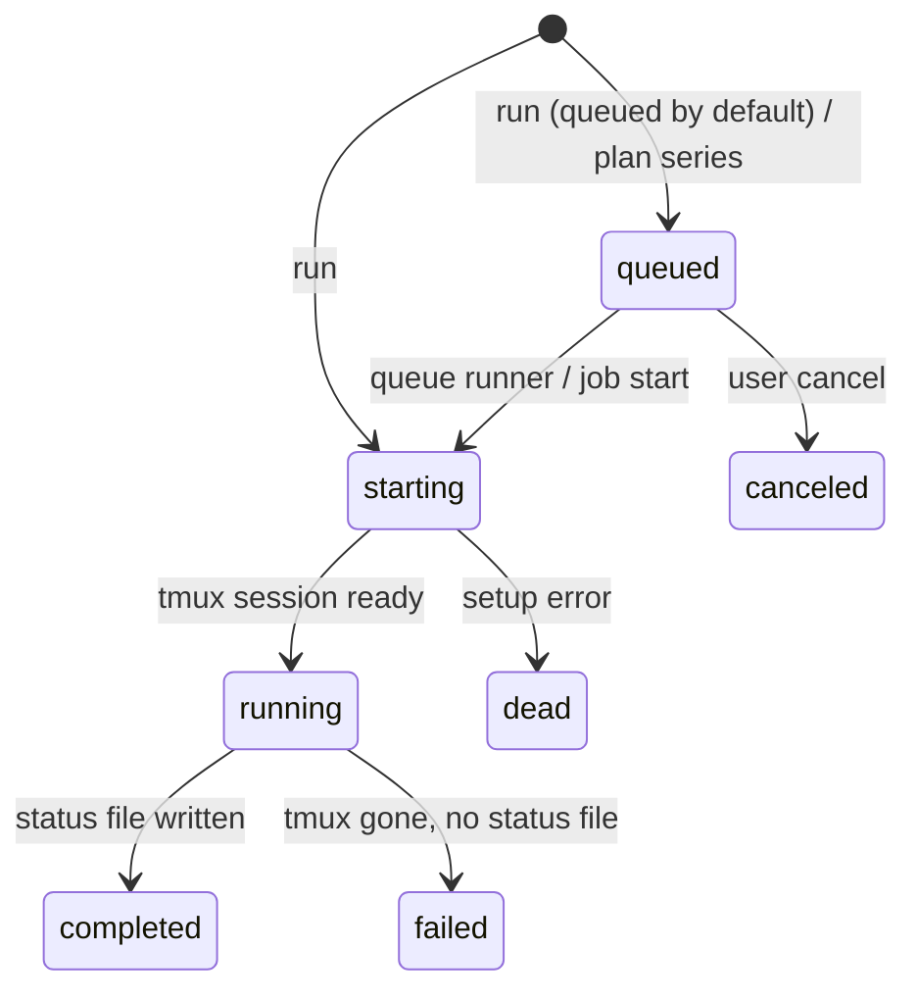
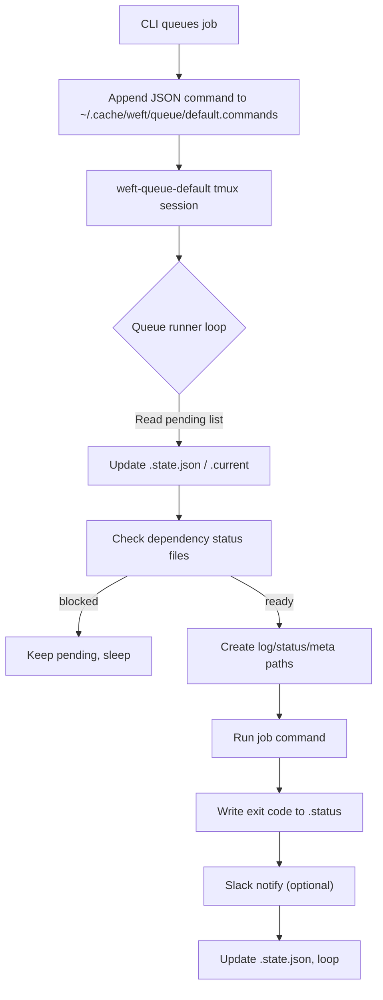

# Weft Architecture

This document describes the architecture and design of weft. For the
coordinator-specific design (placement scoring, data locality, pre-staging),
see [Coordinator Architecture](coordinator-architecture.md).

## Overview

Weft is a coordinator-based workload scheduler for GPU compute clusters. It has
three main components:

1. **CLI / TUI** (laptop) — submits jobs as intents, monitors status
2. **Coordinator** (studio) — scores hosts, pre-stages data, dispatches jobs
3. **Go agent** (each remote host) — autonomous queue runner with GPU management

```
┌─────────────────────────────────────────────────────────────────────┐
│                       Laptop (CLI / TUI)                             │
├─────────────────────────────────────────────────────────────────────┤
│  ┌──────────────┐    ┌──────────────┐    ┌──────────────────────┐  │
│  │   CLI (cmd)  │───▶│   Database   │    │   Config (YAML)      │  │
│  │              │    │   (SQLite)   │    │   Host Inventory     │  │
│  └──────┬───────┘    └──────────────┘    └──────────────────────┘  │
│         │                                                           │
│         │ Intent files (via SSH)                                     │
│         ▼                                                           │
├─────────────────────────────────────────────────────────────────────┤
│                    Coordinator (studio)                               │
├─────────────────────────────────────────────────────────────────────┤
│  ┌──────────────┐    ┌──────────────┐    ┌──────────────────────┐  │
│  │   Placement  │───▶│  Pre-staging │    │   Intent Watcher     │  │
│  │   Scoring    │    │   (rsync)    │    │   (fsnotify)         │  │
│  └──────┬───────┘    └──────────────┘    └──────────────────────┘  │
│         │                                                           │
│         │ SSH dispatch                                              │
│         ▼                                                           │
├─────────────────────────────────────────────────────────────────────┤
│                      Remote Host(s)                                  │
├─────────────────────────────────────────────────────────────────────┤
│  ┌──────────────┐    ┌──────────────┐    ┌──────────────────────┐  │
│  │  Go Agent    │───▶│   Job Logs   │    │   Slack Notify       │  │
│  │  (weft-agent)│    │   (.log)     │    │   (on completion)    │  │
│  └──────────────┘    └──────────────┘    └──────────────────────┘  │
└─────────────────────────────────────────────────────────────────────┘
```

When the coordinator is unreachable, the CLI falls back to local placement
scoring and direct SSH dispatch — the same job submission works either way.

### Facades vs Core

User-facing layers (CLI + TUI) now call into a shared core service that owns
validation, database mutations, and reconciliation with remote hosts. This
guarantees that every operation—whether triggered by a key binding or a Cobra
command—runs through the same code path. The facades handle only input parsing,
presentation, and read-heavy listing queries. The core service records intent,
kicks off sync, and returns structured results. See
[CLI, TUI, and Core Responsibilities](facade-core.md) for details on the
responsibilities split.

## Job States

Every job lives in the local SQLite database and transitions through a finite
set of states. The CLI records each transition so commands such as `status`,
`list`, and `sync` can reason about progress even when the host is offline.

| State       | Description                                                                 |
|-------------|-----------------------------------------------------------------------------|
| `starting`  | Job entry created; CLI is preparing the tmux session and remote files.      |
| `running`   | tmux session launched successfully and the wrapper script is executing.     |
| `completed` | Job wrote an exit code to the `.status` file (success or failure recorded). |
| `dead`      | Job failed to start (setup error before tmux/session execution).            |
| `failed`    | Job terminated unexpectedly after starting (no status file found).          |
| `killed`    | Job was terminated in response to an explicit user action.                  |
| `canceled`  | Queued job was explicitly removed before it started.                        |
| `queued`    | Job was added to a remote queue and awaits the queue runner.                |
| `pending`   | Local intent recorded (kill/start/change) awaiting reconciliation.          |
| `draft`     | Job saved locally but not yet submitted to a remote host.                   |
| `pending_placement` | Job submitted to the coordinator but not yet placed on a host.     |



Note: Jobs that need cloud GPUs are `queued` with no host assigned (unplaced).
The TUI displays these as `$ needs rental`.

## Directory Structure

```
weft/
├── main.go                 # Entry point
├── cmd/                    # CLI commands (Cobra)
│   ├── root.go            # Root command, default command handling
│   ├── run.go             # Start jobs (supports --from, --timeout, --input, --output)
│   ├── host.go            # Host inventory and data locality commands
│   ├── coordinator.go     # Coordinator daemon management
│   ├── sync.go            # Sync job statuses + deploy agent binary
│   ├── queue.go           # Queue commands (add, start, stop, list)
│   ├── tui.go             # Launch interactive TUI
│   └── ...                # job, kill, log, restart, cleanup,  etc.
├── cmd/agent/              # Go agent binary (deployed to remote hosts)
│   └── main.go            # Entry point for weft-agent run-queue
├── internal/
│   ├── coordinator/       # Coordinator daemon (intent watcher, dispatch)
│   ├── placement/         # Placement scoring (GPU, data locality, utilization)
│   ├── inventory/         # Host YAML specs (embedded), GPU/CPU capabilities
│   ├── dataloc/           # Data locality tracking (HF cache scanner, asset DB)
│   ├── prestage/          # Pre-staging (rsync missing data before dispatch)
│   ├── runner/            # Go queue runner (production agent)
│   ├── agentdeploy/       # Cross-compile and deploy agent binary to hosts
│   ├── campaign/          # Cloud GPU campaigns (launch, cost estimation, formatting)
│   ├── vastai/            # Vast.ai cloud GPU CLI wrapper and wrapper scripts
│   ├── db/                # Database operations (SQLite)
│   ├── ops/               # Unified job operations (CLI + TUI)
│   ├── ssh/               # SSH operations and connection pool
│   ├── session/           # Session/file path management
│   ├── tui/               # Terminal UI (Bubble Tea)
│   ├── web/               # Web dashboard (cluster overview, API endpoints)
│   ├── config/            # Configuration management
│   ├── logcache/          # Offline cache for finished job logs
│   ├── oplog/             # Structured operation logging (JSON lines)
│   └── ...                # progress, llm, queuejob, plan, etc.
└── docs/
    ├── architecture.md    # This document
    ├── coordinator-architecture.md  # Coordinator design and migration phases
    └── workflow-guide.md  # Common workflows with examples
```

## Core Components

### 1. CLI Layer (`cmd/`)

Built with [Cobra](https://github.com/spf13/cobra), the CLI provides subcommands for all operations.

**Command Flow:**

```
weft run [--from ID] [--timeout DURATION] <host> <command>
    │
    ├── 0. (If --from) Copy settings from existing job (can override)
    ├── 1. Create job record in SQLite (status: "starting" or "queued")
    ├── 2. Generate unique tmux session name (rj-{job_id})
    ├── 3. Create log directory on remote (~/.cache/weft/logs/)
    ├── 4. Save metadata file on remote
    ├── 5. Build wrapper command (cd, logging, exit code, timeout monitor)
    ├── 6. SSH: tmux new-session -d -s 'rj-N' bash -c '...'
    ├── 7. Update job status to "running"
    └── 8. Print monitoring instructions
```

**Key Flags:**
- `--from <id>`: Copy settings from existing job (command, directory, description)
- `--timeout <duration>`: Automatically kill job after duration (e.g., "2h", "30m")

**Key Design Decisions:**
- Job ID is allocated BEFORE starting the tmux session, ensuring the database always knows about the job
- If SSH fails during setup, the job is marked as "dead" with the error message
- Connection failures automatically record the job locally and defer the queue
  append so it starts once the host is back online—no special retry flag needed.
- `weft run --from <id>` lets you copy settings into a brand-new job when
  you want to make edits before re-running.

### 2. Operations Layer (`internal/ops/`)

Provides unified job operations used by both CLI and TUI. All operations follow the same queue-and-execute pattern for network resilience.

**Pattern:**
1. Update the local database to reflect the intended state (e.g., `pending_status` = "killed").
2. Attempt to drain the queue for that host
3. If host unreachable, operation stays queued for next sync
4. If host reachable, execute and remove from queue

**Key Functions:**

| Function | Purpose |
|----------|---------|
| `KillJob` | Kill a running job's tmux session |
| `RunJob` | Start a new job on a host |
| `RequeueJob` | Archive current run and requeue job with same ID |
| `QueueAndExecute` | Core pattern: queue operation, then drain |
| `SyncAndReconcile`           | Probe remote, then reconcile local and remote states  |

**Conflict Resolution:**

When operations conflict, later operations cancel earlier incompatible ones:
- Killing a job removes any pending run/restart operations for that job
- This prevents "zombie" operations from executing after a job is killed

**Benefits:**
- Consistent behavior between CLI and TUI
- Network-resilient: operations survive disconnections
- Idempotent: duplicate operations are detected and skipped

### 3. Database Layer (`internal/db/`)

Uses [modernc.org/sqlite](https://gitlab.com/cznic/sqlite) (pure Go SQLite) for zero CGO dependencies.

**Schema:** See `initSchema()` in `internal/db/db.go` for the current schema.
The `jobs` table stores all job state, with status constants defined at the top
of the same file.

### 4. SSH Layer (`internal/ssh/`)

Wraps SSH/SCP commands with error handling and retry logic.

See `internal/ssh/` for the full API. The SSH layer distinguishes connection
errors (which may be transient) from command errors (which indicate real
failures), using regex pattern matching on SSH output.

### 5. Session Management (`internal/session/`)

Manages tmux session naming and remote file paths.

Manages remote file paths for job logs, status, metadata, and PID files
under `~/.cache/weft/logs/`. See `internal/session/` for path conventions.

Jobs run inside a wrapper that changes to the working directory, runs the
command, captures the exit code to a status file, and optionally triggers
Slack notification. The wrapper is generated by the runner — see
`internal/runner/` for details.

### 6. TUI (`internal/tui/`)

Built with [Bubble Tea](https://github.com/charmbracelet/bubbletea) (Elm architecture) and [Lipgloss](https://github.com/charmbracelet/lipgloss) (styling).

**Architecture:**

```
┌─────────────────────────────────────────────────────────┐
│                      Model                               │
├─────────────────────────────────────────────────────────┤
│  Jobs View:                    Hosts View:               │
│  - jobs []*db.Job              - hosts []*Host           │
│  - selectedIndex               - selectedHostIdx         │
│  - selectedJob (for logs)      - host info cache         │
│  - processStats                                          │
│  - logContent                                            │
├─────────────────────────────────────────────────────────┤
│  Background Operations:                                  │
│  - syncInterval (15s)          - Sync job statuses       │
│  - logRefreshInterval (3s)     - Refresh logs/stats      │
│  - hostRefreshInterval (30s)   - Refresh host info       │
└─────────────────────────────────────────────────────────┘
           │
           │ Update(msg)
           ▼
┌─────────────────────────────────────────────────────────┐
│  Message Types:                                          │
│  - tea.KeyMsg              - Keyboard input              │
│  - jobsRefreshedMsg        - DB query result             │
│  - syncCompletedMsg        - Background sync done        │
│  - logFetchedMsg           - SSH log fetch result        │
│  - processStatsMsg         - CPU/GPU stats               │
│  - hostInfoMsg             - Host system info            │
│  - tickMsg                 - Timer for background ops    │
└─────────────────────────────────────────────────────────┘
           │
           │ View()
           ▼
┌─────────────────────────────────────────────────────────┐
│  ╭─────────────────────────────────────────────────────╮│
│  │ ID   HOST         STATUS    STARTED   COMMAND      ││
│  │ 52   deepthought  ● running 2h ago    python ...   ││
│  │ 51   deepthought  ✗ exit 1  3h ago    python ...   ││
│  ╰─────────────────────────────────────────────────────╯│
│  ╭─────────────────────────────────────────────────────╮│
│  │ Details / Logs                                      ││
│  │ Job 52 on deepthought                               ││
│  │ Cmd: python train.py                                ││
│  │ CPU: 45% (1h23m user, 5m sys)                       ││
│  │ GPU 0: 85% util, 12.5GiB                            ││
│  ╰─────────────────────────────────────────────────────╯│
│  ↑/↓:nav l:logs s:sync n:new r:restart k:kill q:quit   │
└─────────────────────────────────────────────────────────┘
```

**Key TUI Features:**
- Two views: Jobs (default) and Hosts
- Split-screen: list at top, details/logs at bottom
- Background polling for status updates
- Real-time CPU/GPU stats for running jobs
- Modal overlays for job creation and long operations

### 7. Configuration (`internal/config/`)

Configuration at `~/.config/weft/config.toml`:

```yaml
default_command: tui    # "help", "watch", "list", "tui", or "web"
sync_interval: 15       # Seconds between status syncs
log_refresh_interval: 3 # Seconds between log refreshes
host_refresh_interval: 30
web_enabled: true
web_port: 8127
```

### 8. Log Cache (`internal/logcache/`)

Remote log files are mirrored into `~/.cache/weft/logs/` whenever a job
finishes (or the queue runner writes a status file) so that `weft log`
and the TUI can fall back to an offline copy. The cache honors the configurable
age/size caps, prunes stale entries during `weft sync`, and quietly skips
files that are too large. When you run `weft log JOB_ID`, the CLI serves
cached bytes immediately and only re-fetches from SSH if the cache misses or
the job is still running.

### 9. Progress Tracking (`internal/progress/`)

The progress subsystem tracks how much of each log has already been tailed and
parses progress lines to present inline percentages. Supported formats include
`Progress: 75%`, `Progress: 9/14`, tqdm bars (`45%|████▌ |`), and epoch
counters (`Epoch 3/10`). The tracker feeds both the job list (status column
shows `● 42%`) and the detail pane (progress bar plus `step/total`) without
constantly re-downloading entire logs from the host.

For multi-phase jobs (where progress resets from 100% back to 0%), a
`PhaseTracker` detects restarts and the display layer estimates total phases
using a truncated Poisson prior. Multi-phase progress is shown with an `≈`
prefix (e.g., `≈52%`) to indicate the value is estimated. See
[Logging and Progress](../reference/logging-and-progress.md) for details.

### 10. AI Descriptions (`internal/llm/`)

If AI is enabled in config, a background generator polls the database for jobs
missing descriptions and asks an [ollama](https://ollama.com/) model to produce
one. Each description stores a hash of the model/prompt/settings combination so
future runs can skip already processed commands. The TUI registers a callback
so rows update live the moment an AI description is written, and any manual
`weft describe` edits override the generated text permanently.

### 11. Queue Helpers (`internal/queuejob/`, `internal/plan/`)

Queue-heavy workflows use dedicated helpers. `internal/queuejob` knows how to
update the append-only command log in `~/.cache/weft/queue/*.commands`,
rehydrate metadata, and start a job immediately even if it never reached the
remote queue (pending deferred op). `internal/plan` parses YAML plans, expands
IDs/aliases, validates per-host dependency DAGs, and emits queue operations that
match the semantics documented in [Job Plans](../reference/job-plans.md). Together
they let both humans and agents orchestrate large job graphs while keeping
local/remote state consistent even when connections flap.

## Data Flow

### Starting a Job

`weft run` resolves the target host (via placement scoring or explicit flag),
records the job in SQLite, generates remote paths, dispatches via SSH, and
updates the job status. For queued jobs, the remote Go agent picks them up.
See `cmd/run.go` for the full flow.

### Checking Job Status

`weft sync` queries the database for active jobs, probes each host via SSH,
and reconciles local state with remote reality (status files, process checks).
See `cmd/sync.go` and `internal/ops/` for the reconciliation logic.

## External Dependencies

| Package | Purpose |
|---------|---------|
| `github.com/spf13/cobra` | CLI framework |
| `github.com/charmbracelet/bubbletea` | TUI framework (Elm architecture) |
| `github.com/charmbracelet/bubbles` | TUI components (text input) |
| `github.com/charmbracelet/lipgloss` | TUI styling |
| `modernc.org/sqlite` | Pure Go SQLite (no CGO) |
| `gopkg.in/yaml.v3` | YAML config parsing |

## Remote Host Requirements

- **tmux**: Creates persistent sessions
- **bash**: Shell for wrapper commands
- **curl**: Slack notifications (optional)
- **nvidia-smi**: GPU stats (optional)

## File Locations

### Local (Client Machine)

| Path | Purpose |
|------|---------|
| `~/.config/weft/jobs.db` | SQLite database |
| `~/.config/weft/config.toml` | Configuration |
| `~/.config/weft/config` | Legacy config (Slack webhook) |

### Remote (Server)

| Path | Purpose |
|------|---------|
| `~/.cache/weft/logs/{id}-{ts}.log` | Job output |
| `~/.cache/weft/logs/{id}-{ts}.status` | Exit code |
| `~/.cache/weft/logs/{id}-{ts}.meta` | Metadata |
| `~/.cache/weft/logs/{id}-{ts}.pid` | Process ID |
| `/tmp/weft-notify-slack.sh` | Notification script (deployed at runtime) |

## Design Decisions

### Why tmux instead of nohup/screen?

- **Session naming**: tmux allows named sessions that can be queried
- **Session persistence**: Sessions survive SSH disconnects
- **Widely available**: Pre-installed on most Linux servers
- **Status checking**: Can detect if session is still running

### Why SQLite?

- **Zero setup**: No server process needed
- **Single file**: Easy backup, portability
- **modernc.org/sqlite**: Pure Go, no CGO required
- **Local queries**: Fast filtering, searching, cleanup

### Why Bubble Tea for TUI?

- **Elm architecture**: Clean separation of state, updates, and views
- **Async-friendly**: Natural handling of SSH operations
- **Good ecosystem**: lipgloss for styling, bubbles for components

### Why embed the notify script?

- **Zero remote setup**: Script deployed with each job
- **Version consistency**: Script matches client version
- **Simpler workflow**: No separate installation step

### Agents as first-class users

- **Suggested next commands**: CLI responses include ready-to-run follow-ups so
  autonomous agents keep context without bespoke skills files.
- **TUI monitoring**: Humans can supervise and adjust queues while agents focus
  on issuing CLI operations.
- **Plan syntax**: YAML plans were intentionally shaped so agents can emit them
  directly from prompts, harnessing the same dependency/queue logic as humans.

### Occasionally connected hosts

- **Local-first state**: Jobs and queue operations persist in SQLite before any
  SSH call, guaranteeing intent is saved even if the network drops.
- **Deferred operations**: Everything that touches a host (start, kill, move,
  queue edits) is recorded and replayed when the host comes back.
- **Most-recent view**: The CLI/TUI always show the latest known state and make
  it obvious which operations are pending for the next successful sync.

## Error Handling

### Connection Errors

- Detected via regex pattern matching on SSH output
- Retry logic with configurable attempts and delays
- Failed operations are recorded locally and replayed once the host reconnects

### Job Failures

- Exit code captured in status file
- Jobs without status files marked as "failed"
- Error messages stored in database for debugging

### TUI Resilience

- SSH operations use timeouts to prevent UI blocking
- Failed fetches preserve previous data
- Background operations continue even if some hosts unreachable

## Queue System

The queue system allows jobs to run on a remote host without requiring the local machine to stay connected. The queue runner can run multiple jobs concurrently while keeping total CPU usage under a target cap; per-job CPU allotments come from the database (default when unset).

### Queue Architecture

```
┌─────────────────────────────────────────────────────────────────────┐
│                          Local Machine                               │
├─────────────────────────────────────────────────────────────────────┤
│  ┌──────────────┐    ┌──────────────┐                               │
│  │  queue add   │───▶│   Database   │  Records job with             │
│  │              │    │   (SQLite)   │  status="queued"              │
│  └──────┬───────┘    └──────────────┘                               │
│         │                                                           │
│         │ SSH: Append to queue command log                           │
│         ▼                                                           │
├─────────────────────────────────────────────────────────────────────┤
│                         Remote Host                                  │
├─────────────────────────────────────────────────────────────────────┤
│  ┌──────────────┐    ┌──────────────┐    ┌──────────────────────┐  │
│  │ Queue Runner │◀───│  Queue Log   │    │   Job Logs           │  │
│  │ (tmux)       │    │  (.commands) │    │   (.log, .status)    │  │
│  └──────┬───────┘    └──────────────┘    └──────────────────────┘  │
│         │                                                           │
│         │ For each job: run, capture output, notify                 │
│         ▼                                                           │
│  ┌──────────────┐                                                   │
│  │ Slack Notify │                                                   │
│  │ (on complete)│                                                   │
│  └──────────────┘                                                   │
└─────────────────────────────────────────────────────────────────────┘
```

### Remote Queue Runner (Go Agent)

Jobs enqueued via `weft queue add`, `weft run`, or plan
`series` blocks are executed by the Go agent (`weft-agent`) on each host.

- The agent binary is cross-compiled and deployed via `internal/agentdeploy/`
  to `~/.cache/weft/bin/weft-agent` on remote hosts.
- A tmux session named `weft-queue-default` runs `weft-agent run-queue` so it
  keeps running even when you disconnect.
- Queue data is purely file-based to avoid keeping a network service running:
  - `~/.cache/weft/queue/default.commands`: append-only JSONL command log.
  - `~/.cache/weft/queue/default.state.json`: runner state (pending list,
    running jobs, current job).
  - `~/.cache/weft/queue/default.current`: ID of the most recently
    started job (used by `status`/`sync` to detect runner progress).
  - `~/.cache/weft/queue/default.runner.pid`: PID of the runner itself.
  - `~/.cache/weft/queue/default.stop`: Presence signals the runner to
    exit after the current jobs complete.
- Each queue entry includes environment variables, dependency metadata, and
  optional CPU allotment so the runner can schedule concurrent jobs while
  keeping total CPU usage under a target cap.



**Activity Notes**

- Dependencies: The runner inspects `~/.cache/weft/logs/{dep}-*.status`
  files. If they are missing it re-queues the job at the end. If a dependency
  failed and the spec required success, the job is marked skipped by writing a
  log/status pair.
- Environment: The queue entry includes `env` as a JSON array of `VAR=value`
  strings. The runner exports them before launching the command.
- Metadata: A `.meta` file is written before execution so later `sync` calls can
  recover `start_time`, display-friendly command, etc.
- Queue persistence: Because the queue command log/state are just files, jobs survive
  remote reboots. Re-starting the runner tmux session picks up where it left
  off.

The combination of queue log/state files plus the runner loop means no long-lived process
is required on the local machine once the job is queued—the remote host and its
tmux sessions orchestrate everything.

### Cloud Instances

Ephemeral Vast.ai instances run the same Go agent (`weft-agent run-job`) as
persistent hosts, providing identical telemetry and failure detection. The cloud
launcher deploys the agent binary and rsyncs project sources via SSH, then starts
a thin shell wrapper (~30 lines) that:

1. Invokes `weft-agent run-job` for each assigned job (piping job JSON via stdin)
2. Uploads per-job results (logs, completion record, timeseries, phases) to R2
3. Writes a campaign completion marker to R2
4. Self-destructs the instance

This replaces the previous ~150-line bash wrapper that reimplemented telemetry
collection. See `internal/cloud/wrapper.go` (`GenerateAgentWrapper`) and
`internal/campaign/lifecycle.go` for the deployment flow.

## Shell Escaping and Quoting

Data passes through multiple shell contexts between the Go CLI and job
execution. This is a frequent source of bugs and requires careful attention.

### Data Flow Through Shell Contexts

1. **Go CLI** → builds SSH command string
2. **Local shell** → interprets SSH command
3. **SSH transport** → passes to remote shell
4. **Remote shell** → executes command or appends to queue log
5. **Go agent** → reads queue log/state, parses jobs, executes job

### Current Escaping Strategy

Queue commands are stored as JSONL entries in the `.commands` file:

```
{"ts":"...","op":"add","job":{"id":123,"dir":"...","cmd":"...","desc":"...","env":["..."],"deps":"...","cpu":60}}
```

On the remote side, the Go agent (`weft-agent run-queue`):
1. Reads each JSONL line from the command log
2. Parses the JSON `job` object natively in Go
3. Executes the command string as provided

### Known Bug Pattern

With the JSONL format, the main failure mode is malformed JSON or a truncated
command log line. These show up as parse errors in the agent logs.

### Architectural Alternatives

The JSONL format is simple and debuggable. Potential alternatives:

1. **Length-prefixed binary**: Unambiguous parsing, no escaping needed. Not
   human-readable.

2. **Structured file per job**: One JSON/YAML file per queued job in a
   directory. Eliminates multi-field parsing entirely but adds filesystem
   overhead.

The current approach is retained for debuggability (queue logs/state files are
human-readable text) and relies on standard JSON escaping instead of custom
parsing rules.

### Testing Escaping

`TestQueueEntryShellParsing` in `internal/ops/queue_test.go` verifies that
queue entries with multi-line commands survive the full escaping round-trip
by actually running bash to parse them the same way the queue runner does.
